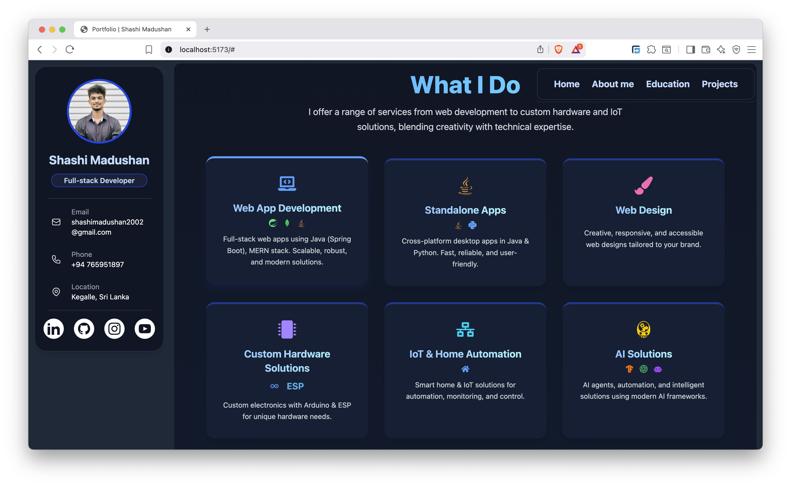

# Portfolio React + Supabase

<!-- Project Description -->
This project is a personal developer portfolio web application designed to highlight your professional journey, technical skills, and open-source contributions. It provides an interactive platform to showcase your featured projects, display live GitHub statistics, and present your expertise in a visually appealing and organized manner. The portfolio is fully responsive, easily customizable, and integrates seamlessly with modern developer tools and APIs.

---

## 🚀 Features

- **Project Showcase**: Display your latest and featured projects with images, descriptions, and links.
- **GitHub Integration**: Fetch and display your GitHub repositories and language stats.
- **Skills & Technologies**: Highlight your tech stack and expertise.
- **Services Section**: List the services you offer.
- **Responsive Design**: Looks great on all devices.
- **Easy Customization**: Update your data via JSON or API.
- **Modern UI**: Built with Tailwind CSS and React Icons.

---

## 🖼️ Screenshots

<!-- Add your screenshots below -->
<p align="center">
  
</p>


---

## 🛠️ Tech Stack

- **Frontend**: [React](https://react.dev/), [TypeScript](https://www.typescriptlang.org/), [Vite](https://vitejs.dev/)
- **Styling**: [Tailwind CSS](https://tailwindcss.com/), [React Icons](https://react-icons.github.io/react-icons/)
- **Charts**: [Recharts](https://recharts.org/)
- **Routing**: [React Router](https://reactrouter.com/)
- **API/Backend**: [Supabase](https://supabase.com/) (optional, for real data)
- **Linting**: [ESLint](https://eslint.org/)

---

## 📁 Folder Structure

```
portfolio-react-superbase/
├── public/
├── src/
│   ├── assets/              # Images, icons, etc.
│   ├── components/          # Reusable React components
│   ├── data/                # Static JSON data (projects, skills, etc.)
│   ├── pages/               # Page components (About, Home, etc.)
│   ├── utils/               # Utility functions (API, helpers)
│   ├── App.tsx
│   ├── main.tsx
│   └── ...other files
├── package.json
├── tailwind.config.js
├── tsconfig.json
├── README.md
└── ...
```

---

## 🔧 Customization

- **Projects**: Edit `src/data/projects.json` to add or update your projects.
- **Skills/Technologies**: Update the relevant sections in `src/pages/About.tsx`.
- **GitHub Stats**: Update your GitHub username in the API utility if needed.
- **Images**: Place your screenshots in the `screenshots/` folder and reference them in the README.

---
